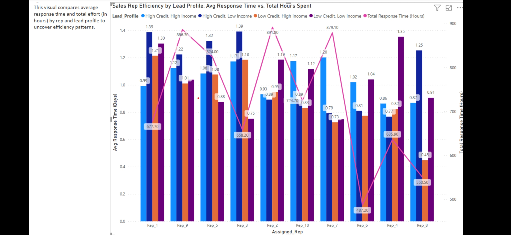

# Fintech Lead Distribution Dashboard

## Overview  
This Power BI dashboard analyzes lead assignment patterns within a simulated fintech sales team. The goal is to evaluate whether leads are distributed fairly across sales reps and whether certain reps consistently outperform others with specific lead types.

## Objective  
To assess the impact of rep-lead alignment on close rates and revenue, and uncover opportunities to optimize lead distribution strategy.

## Key Questions  
- Are leads being fairly distributed among sales reps?
- Do reps perform better when assigned leads that match their strengths?
- Which lead profiles are most/least likely to close?
- Are high-potential leads being underutilized?

## Key Metrics  
- **Match vs Mismatch Close Rate:**  
  Compares close rates based on whether a lead’s profile aligns with the rep’s historical strengths.

- **Average Response Time:**  
  Days between lead assignment and rep outreach.

- **Total Hours Spent per Lead:**  
  Measures rep effort to assess lead value vs. time spent.

- **Lead Close Rate by Profile:**  
  Evaluates performance based on lead credit tier, industry, and revenue band.

- **Rep-Level Summary:**  
  Compares total assigned leads, average performance, and efficiency metrics across all sales reps.

## Tools & Skills Used  
- **Power BI** – Data modeling, DAX calculations, interactive dashboard design  
- **Excel** – Data cleaning and preparation  
- **Business Analysis** – Lead distribution strategy, performance analysis, operational insights

## Sample Insights  
- Reps who receive leads aligned to their strengths had a **23% higher close rate**.  
- One rep with below-average performance was consistently assigned high-value leads.  
- A mismatch in lead profiles and rep history correlated with longer response times and lower efficiency.

## Dashboard Preview  

## How It Was Built  
1. Created a mock dataset simulating lead assignments and rep performance.  
2. Cleaned and prepped the data in Excel.  
3. Imported into Power BI and built calculated measures in DAX.  
4. Designed visuals to track key trends, rep comparison, and actionable patterns.

## Future Enhancements  
- Integrate real-time CRM data via API  
- Build a predictive lead assignment model  
- Automate rep performance alerts using Power Automate

## View the Full Dashboard & Files  
[GitHub Repository](https://github.com/jrebecca89/fintech-lead-distribution)
